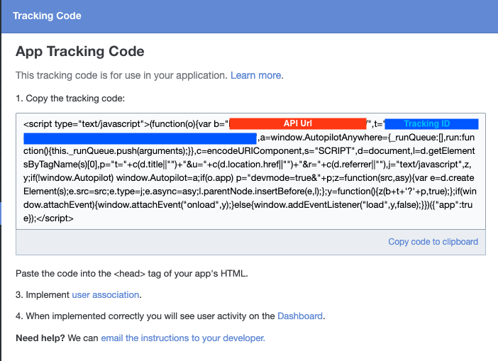

# gatsby-plugin-autopilot

Gatsby plugin for adding Autopilot tracking script to your Gatsby site.

## Install

```bash
yarn add gatsby-plugin-autopilot
```

## How to use

```js
// In your gatsby-config.js
{
      resolve: `gatsby-plugin-autopilot`,
      options: {
        apiUrl: "", // Your unique api URL, found in your tracking code settings in your Autopilot dashboard.
        trackingId: "", // Your unique tracking ID, also found in your tracking code settings.
        app: true, // Determines whether to load webpage or app tracking code.
        exclude: ['/signup', '/about'], // optional
      },
    },
```


